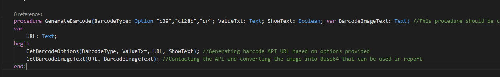
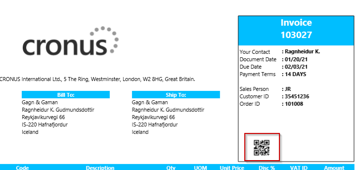

# B365QR-BarcodeExampleCodeunit
An example code of how to generate QR/Barcode with API request and convert to Base64

Barcode API used @ http://barcodes4.me/

1. The report code should call GenerateBarcode function.
2. GenerateBarcode will create the URL for the API and return the image in stream, saves it temporary blob and finally, converts to Base64 string.
3. BarcodeImageText can be used in report header by Code.SetData/GetData

GenerateBarcode

Report Header

Check out barcode API crowd @ http://barcodes4.me/, their API documentation is great and allows creation of more specific barcodes if required.

